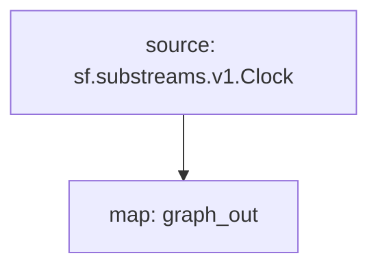

# `Clock` Substream

> Block ID, Number & Timestamp

## Networks
- All chains

### [Latest Releases](https://github.com/pinax-network/subgraphs/releases)

### Quickstart

```bash
$ make
$ make run
```

## Mermaid graph



## Map output

```json
{
  "entityChanges": [
    {
      "entity": "Clock",
      "id": "542d7e9a07a94d93879a51452d6f077a461d311018f0b03377b2d877bb72cdf0",
      "ordinal": "0",
      "operation": "OPERATION_CREATE",
      "fields": [
        {
          "name": "number",
          "newValue": {
            "bigint": "18221781"
          }
        },
        {
          "name": "seconds",
          "newValue": {
            "bigint": "1695753443"
          }
        },
        {
          "name": "nanos",
          "newValue": {
            "bigint": "0"
          }
        },
        {
          "name": "timestamp",
          "newValue": {
            "string": "2023-09-26T18:37:23Z"
          }
        }
      ]
    }
  ]
}
```

### Modules

```yaml
Package name: clock
Version: v0.1.0
Doc: Block ID, number & timestamp
Modules:
----
Name: graph_out
Initial block: 0
Kind: map
Output Type: proto:sf.substreams.sink.entity.v1.EntityChanges
Hash: d2913e1f3c4966817a7cdbbd49db407a1a81ebc9
```