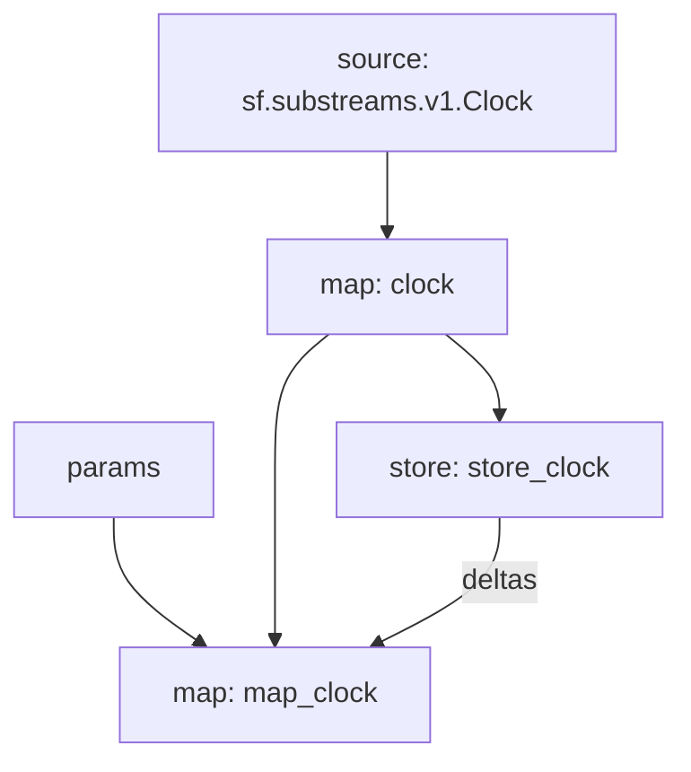

# `Clock` Substream

[](https://github.com/pinax-network/substreams-clock/actions/workflows/test.yml)


> Emits `Clock` map modules at set intervals.
>
> `1m`,`3m`,`5m`,`30m`,`1h`,`2h`,`6h`,`8h`,`12h`,`1d`,`3d`,`m`,`y` are supported.

## Quickstart

```
gh repo clone pinax-network/substreams-clock
cd substreams-clock
make
make gui
```

## Releases `.spkg`

- <https://github.com/pinax-network/substreams-clock/releases>

## Mermaid graph



## Map Outputs

### `graph_out`

```json
{
  "id": "ab79f822909750f88dfb9dd0350c1ebe98d5495e9c969cdeb6e0ac993b80175b",
  "number": "6912",
  "timestamp": "2015-07-31T00:00:01Z"
}
```

### Modules

```yaml
Name: clock
Initial block: 0
Kind: map
Input: source: sf.substreams.v1.Clock
Output Type: proto:sf.substreams.v1.Clock
Hash: 5ecae9cc10aaa9b9cb9965c98964a933c2dd9b98

Name: store_clock
Initial block: 0
Kind: store
Input: map: clock
Value Type: string
Update Policy: set
Hash: c5a6015c4e8d253314c64f83ebc90dbe4f576863

Name: map_clock
Initial block: 0
Kind: map
Input: params: 1d
Input: map: clock
Input: store: store_clock
Output Type: proto:sf.substreams.v1.Clock
Hash: ea19f6c6c13b27ca4a53f81689173c5a41cfe80f
```
