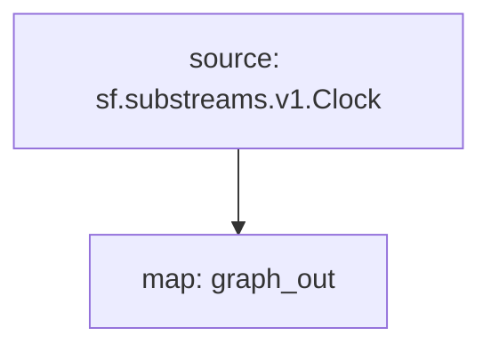

# `Clock` Substream

> Block ID, Number & Timestamp

## Networks
- All chains

### [Latest Releases](https://github.com/pinax-network/substreams/releases)

### Quickstart

```bash
$ make
$ make run
```

## Mermaid graph



Here is a quick link to see the graph:

https://mermaid.live/edit#pako:eJx0zL2KhDAUxfFXCadWcdkulusb7HZGljvJ9YMxRpLcgUF89wGnsJryf35wdtjgGBpjpG1Sf21jVqXO-A-SO0-bvrI_NQ1VklvKkcmn6vFV_SzB3rsUJFrWH7hXZWmkrr_5umvMigKeo6fZQWM3yBN7NtAGjgeSJRscKECSw-9ztdA5CheQzVHmdqYxkn-PxysAAP__TbZHLw

### Modules

```yaml
Package name: clock
Version: v0.1.0
Doc: Block Time & Clock Timestamp for all chains supported by Substreams
Modules:
----
Name: graph_out
Initial block: 0
Kind: map
Output Type: proto:sf.substreams.sink.entity.v1.EntityChanges
Hash: d2913e1f3c4966817a7cdbbd49db407a1a81ebc9
```